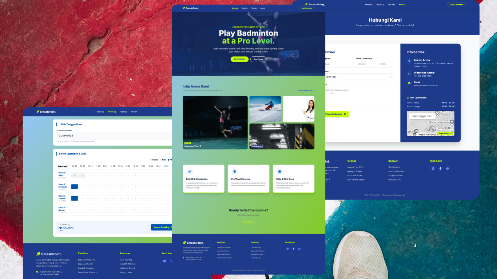

<div align="center">

  

  <br>

  

  <h1 style="font-size: 3rem; margin-top: 20px;">🏸 Badminton Court Website</h1>
  
  <p>
    <strong>Powerful & Responsive Badminton Landing-Page & Booking System</strong>
  </p>

  <p>
    <a href="https://badminton-template.vercel.app/">View Live Demo</a> •
    <a href="#-installation">Installation</a> •
    <a href="#-architecture">Architecture</a>
  </p>

  <p>
    
    
    [
    
  </p>
</div>

---

## ✨ Overview


This project is designed as a **landing page + booking page** for badminton training sessions.  
Users can view training information and submit booking requests, which are stored and managed through a backend service and database.

The main goal of this project is to practice:
- fullstack workflow
- basic backend integration
- real deployment (not just local demo)

## 🛠️ Key Features

- 🏸 Landing page for badminton training information
- 📅 Booking page with form submission
- 🗄️ Backend-connected database for storing bookings
- 🔄 Real-time form handling (no static mock data)
- 🌐 Deployed and accessible online via Vercel
- 📱 Responsive layout for desktop and mobile

---

## Tech Stack

**Frontend**
- HTML
- CSS
- JavaScript
- Tailwind CSS

**Backend**
- Python (basic backend logic)
- Flask
- API endpoint for handling booking data

**Database**
- Simple database integration for storing booking entries

**Deployment**
- Vercel (frontend + serverless backend)

---

## 🏗️ Architecture

Bagaimana cara kerjanya menampilkan Repo Private dengan aman?

```
flowchart LR
    User[👤 Visitor / Client Browser]
    Frontend[🌐 Frontend<br/>HTML / CSS / JS]
    Backend[🧠 Backend API<br/>Flask / Python]
    Database[(🗄️ Database)]
    GitHub[🐙 GitHub API<br/>(Private Repo)]
    Vercel[🚀 Vercel Platform]

    User --> Frontend
    Frontend --> Backend
    Backend --> Database
    Backend --> GitHub
    Frontend --> Vercel
    Backend --> Vercel
